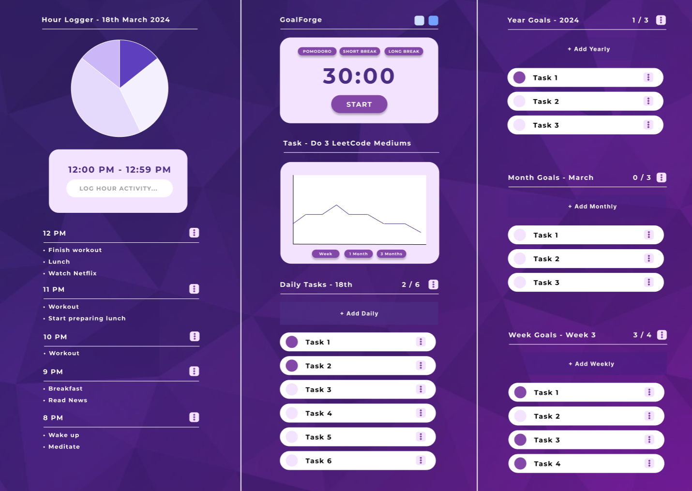

# GoalForge

Open source repository to develop GoalForge. A tool to assist in micro and macro task management. Currently has most of the features in the MVP design and is a WIP.

Webapp link: [https://goalforge.vercel.app](https://goalforge.vercel.app)

API respository: [goalforge-api](https://github.com/afutofu/goalforge-api)

## Final MVP Design



## Current features

- Pomodoro Timer (top center) with configurable timing
- Day, Week, Month, and Year task lists (center and right)
- Hour activity logger (on the left)
- Login using Google OAuth to save state
- Associate tasks with each other (multiple tasks can be under the same category)

## Future implementations

- Task timer and graph to record time for each task category
- Theme selection (Beige, Dark)
- Navigating different dates (to see past & future planned tasks / activity logs)
- Drag & drop list items
- Dashboard page
- Journal page
- Google calendar integration

## Getting Started

These instructions will get you a copy of the project up and running on your local machine for development and testing purposes.

### Installing

1 **Clone the repository**

```bash
git clone https://github.com/afutofu/goalforge.git
```

2 **Navigate to the project directory**

```bash
cd goalforge-api
```

3 **Install dependencies**

```bash
npm install
```

4 **Run the development server**

```bash
npm run dev
# or
yarn dev
# or
pnpm dev
# or
bun dev
```

5 Open [http://localhost:3000](http://localhost:3000) with your browser to see the result.

## Built With

- NextJS
- Tailwind
- Zustand
- React Query

## Authors

- Afuza - Implemented design and state management; Designed UI/UX.
